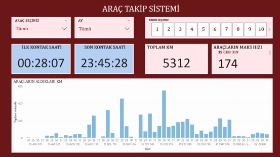

# Çoklu API Entegrasyonu ve Araç Takip Analitiği Pipeline Projesi

[](https://www.python.org)
[](https://en.wikipedia.org/wiki/REST)
[](https://en.wikipedia.org/wiki/Internet_Message_Access_Protocol)
[](https://www.mysql.com)

Bu proje; farklı protokol ve mimarilere sahip üçüncü parti servislerden (REST API, HTTP API ve IMAP) gelen dağınık kurumsal verilerin dinamik olarak yakalanması, Regex (Düzenli İfadeler) ile parse edilmesi, ilişkisel veritabanına (MySQL) güvenli aktarımı ve operasyonel verimliliği artırmak amacıyla Power BI katmanında görselleştirilmesini kapsayan **uçtan uca bir entegrasyon ve iş zekası (BI) pipeline** çalışmasıdır.

---

## 🔌 Entegre Edilen Servisler ve API Mimarisi

Proje kapsamında kurumsal süreçleri otomatikleştirmek adına 3 farklı API ve protokol mimarisi uçtan uca yönetilmiştir:

1. **IMAP Protokol Servisi (Araç Takip Entegrasyonu):** Araç takip sunucularından günlük olarak iletilen ham rapor e-postalarına `IMAPClient` ve `pyzmail` kütüphaneleriyle secure login olunması, okunmamış (UNSEEN) maillerin filtrelenmesi ve e-posta gövdesinin Regex ile ayrıştırılması.
2. **Posta Güvercini HTTP SMS API (Ağ İzleme Entegrasyonu):** Ağ sunucularından ping/socket metotlarıyla dönen yanıtlar başarısız olduğunda, Posta Güvercini servisinin `https://www.postaguvercini.com/api_http/sendsms.asp` uç noktasına (endpoint) URL-encoded veri yapısıyla HTTP POST istekleri atılarak kritik kişilere anlık SMS uyarı mekanizmasının tetiklenmesi.
3. **Holocrow / Ayvos REST API (Kişi Sayım Entegrasyonu):** Mağaza içi kişi sayım sistemlerinden veri çekmek amacıyla ilgili servise token tabanlı kimlik doğrulama (Token-Based Authentication) isteklerinin atılması; dönen JWT/Token ile cihaz ve bölge listelerinin JSON formatında asenkron olarak parse edilmesi.

---

## 🏗️ Veri Akışı ve Pipeline Süreci (Data Flow)

1. **Extraction (Veri Çekme):** Airflow veya cron zamanlayıcıları ile tetiklenen Python betikleri, API endpoint'lerine ve IMAP sunucularına güvenli bağlantı sağlar.
2. **Parsing & Transformation (Veri Ayrıştırma):** E-posta gövdesi veya API'den gelen ham `JSON/XML` metinleri, Python `re` (Regex) modülü kullanılarak plaka, tarih, kat edilen mesafe (km), mesai içi/dışı kullanım oranları ve kontak açılış/kapanış saatleri gibi atomik parametrelere ayrıştırılır.
3. **Loading (Veri Yükleme):** Ayrıştırılan temiz veri kümesi, `mysql-connector-python` sürücüsü üzerinden `vehicle_daily_tracking` tablosuna `INSERT` edilir.
4. **Visualization (Analitik):** Power BI, MySQL tablosuna bağlanarak araçların maksimum hız limit aşımlarını, fazla mesai kullanımlarını ve günlük operasyonel verimlilik raporlarını yöneticilere sunar.

---
## 📊 Proje Çıktıları ve Power BI Paneli


## 📁 Repozitör Klasör Yapısı

```text
vehicle-tracking-analytics/
├── dags/
│   └── vehicle_tracking_dag.py      # Süreçleri otomatize eden Airflow DAG dosyası
├── scripts/
│   ├── email_parser_pipeline.py     # IMAP & Regex tabanlı araç takip scripti
│   ├── network_sms_alert.py         # HTTP SMS API entegrasyon scripti
│   └── holocrow_rest_pipeline.py    # REST API kişi sayım entegrasyon scripti
├── sql/
│   └── create_tracking_table.sql    # MySQL veri tabanı kurulum şeması
├── .env.example                     # API anahtarları ve şifreler için güvenli şablon
├── .gitignore                       # Hassas API token'larını engelleme listesi
└── requirements.txt                 # Gerekli Python bağımlılıkları
